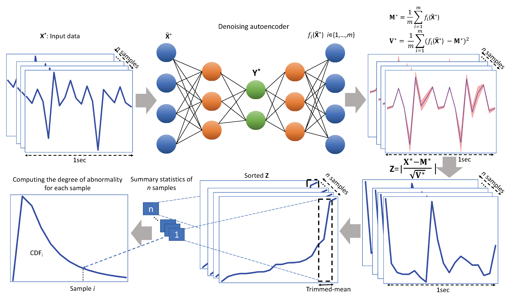
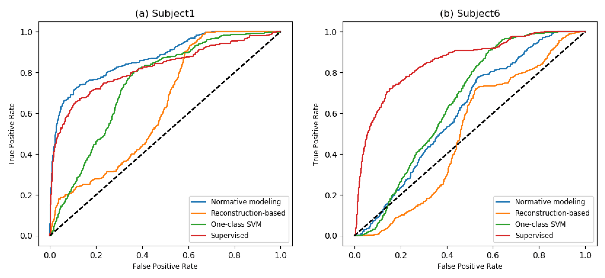

# Novelty Detection using Deep Normative Modeling

This project explores **deep normative modeling** for detecting abnormal human movements based on Inertial Measurement Unit (IMU) data. The approach is inspired by the following paper:

*Mohammadian Rad, N.; Van Laarhoven, T.; Furlanello, C.; Marchiori, E. Novelty Detection using Deep Normative Modeling for IMU-Based Abnormal Movement Monitoring in Parkinson’s Disease and Autism Spectrum Disorders. Sensors 2018, 18(10), 3533.* 

---

## Method Overview

The proposed approach uses a **deep normative modeling framework** based on a denoising autoencoder (DAE). The key idea is to learn a representation of *normal* movements from IMU (Inertial Measurement Unit) sensor data, and then identify movements that significantly deviate from this norm.

- **Denoising Autoencoder (DAE):**  
  The DAE is trained on normal movement data. It compresses the input into a low-dimensional latent representation (*Z*) and reconstructs it back. By learning to denoise corrupted input, the DAE captures the essential structure of normal patterns.

- **Normative Modeling:**  
  After training, the distribution of latent representations (*Z*) is analyzed. Statistical thresholds (e.g., **trimmed-mean ± k·σ**) are calculated to define what is considered “normal.”  
  Any new observation encoded into *Z* that lies outside these normative ranges is flagged as **novelty (abnormal movement).**

- **Novelty Detection:**  
  This framework avoids relying on labeled abnormal data (often scarce) and instead leverages the abundance of normal samples to detect deviations.

**Illustration:**  
The workflow of the method—data encoding, latent representation, normative thresholding, and novelty detection—is summarized in the figure below:

---

##  Performance Evaluation

### Figure 3: Detection Performance
This chart compares the proposed normative model to baseline methods (e.g. one-class SVM and reconstruction-based novelty detection) using ROC curves:
- The **blue curve** corresponds to the normative model.
- It outperforms baseline approaches in detecting deviations effectively, with higher true positive rates for a given false positive rate.

